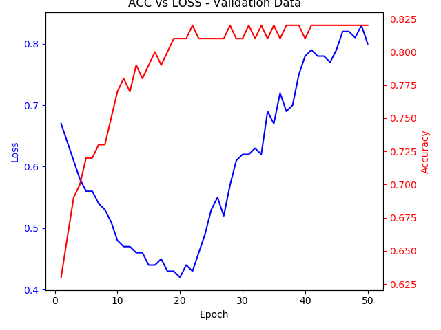
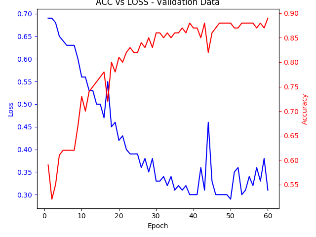

## Competition Description

This is a challenge to classify whether images contain either a dog or a cat. It uses the Asirra (Animal Species Image Recognition for Restricting Access) dataset which is typically used for CAPTCHA (Completely Automated Public Turing test to tell Computers and Humans Apart) or HIP (Human Interactive Proof) web protection challenges.

This challenge was closed in 2014 so I am not submitting my results. However, I want a testbed project where I can continue to explore the Keras and Tensorflow libraries on the heels of completing my Galvanize capstone project. This challenge gives me a baseline for comparing my results.

# Objectives

This challenges provides 25k training images (12.5k dogs and 12.5k cats) and 12.5k test images. The test images are mixed and unlabeled. Given I cannot submit results, I will discard the test images and create a new train/test split by randomly holding out 20% (5k) of of the training data set as a new test set and only train on 20k images.

The following is an evolving list of objectives for this repo.

- Implement the Keras 'little data' example to play around with the process of using a pretrained model.
- Get a baseline using the model developed for my capstone

## Source Code and Data

Files implementing the Keras 'little data' example ([Classification using very little data](https://blog.keras.io/building-powerful-image-classification-models-using-very-little-data.html)). I keep these for experimental and historical purposes.

- [src/little_data_model_v1.py](src/little_data_model_v1.py) is a shallow net with just three convolution and pooling layers trained on 2000 images (1000 cats and 1000 dogs) and obtains a validation accuracy of ~80%. It is based on a Keras blog with minor modifications.    
- [src/little_data_model_v2.py](src/little_data_model_v2.py) is the first of two steps to create a deep learning net capable of training on a small amount of data. Its purpose is to train the fully connected layer on top of a pre-trained VGG16 net. Weight are saved for use in the next script.
- [src/little_data_model_v3.py](src/little_data_model_v3.py) combines FC layer weights obtained in the previous script with a fully trained VGG16 net and fine tunes the last stage of the net.
- [src/little_data_model_v4.py](src/little_data_model_v4.py) a copy of v3 but uses flow(X, y) instead of flow_from_directory and implements a separate rezize function.

Files implementing my solution to the full dataset.

- [src/main.py](src/main.py) - This is the main script to be called when training a model. Currently has several constants to set parameters such as model version, batch size, number of epochs, etc. May move these to command line arguments later.
- [src/cnn_model.py](src/cnn_model.py) - This script contains functions to build various model versions.
- [src/data_generator.py](src/data_generator.py) - This script contains various versions of data generators for the images.
- [src/train_test_split.py](src/train_test_split.py) - creates a train test split of files by randomly holding out 2.5k dog images and 2.5k cat images. This called just once before any pre-processing or before the model can be trained.
- [src/process_images.py](src/process_images.py) - resize images, convert to numpy arrays, and save to disk. This called just once (or after any change to pre-processing) before the model can be trained.

# Results

(state of the art when challenge was originally launched was ~80%)

### CNN Model V1

- Three convolutional stages followed by a fully connected layer
    - Stage 1 filters = 32 (3x3)
    - Stage 2 filters = 64 (3x3)
    - Stage 3 filters = 128 (3x3)
    - Fully connected layer filters = 256 (3x3)
    - All stages included a 2x2 max pooling layer
    - All stages included a dropout layer with value of 0.125 - larger values were tried with poor performance
    - Optimizer = SGD
    - All activation layers use RELU except the final output layer which uses Sigmoid
    - Loss Function = Binary Crossentropy
- Results
    - ~82% (places 89 out of 215)
    - The following plot shows that the model begins to overfit after approximately 20 epochs  

### CNN Model V2

- Three convolutional stages followed by a fully connected layer
    - Stage 1 filters = 16 (3x3)
    - Stage 2 filters = 32 (3x3)
    - Stage 3 filters = 64 (3x3)
    - Stage 4 filters = 128 (3x3)
    - Stage 5 filters = 128 (3x3)
    - Fully connected layer filters = 128 (3x3)
    - All stages included a 2x2 max pooling layer
    - All stages included a dropout layer with value of 0.1 - larger values were tried with poor performance
    - Optimizer = SGD
    - All activation layers use RELU except the final output layer which uses Sigmoid
    - Loss Function = Binary Crossentropy
- Results
    - ~87.5% (places 80 out of 215)
    - The following plot shows that the model begins to overfit after approximately 50 epochs  

### CNN Model V3

- cnn_model_v2 obtains an accuracy of ~xx%
- cnn_model_v3 obtains an accuracy of ~xx%

end
